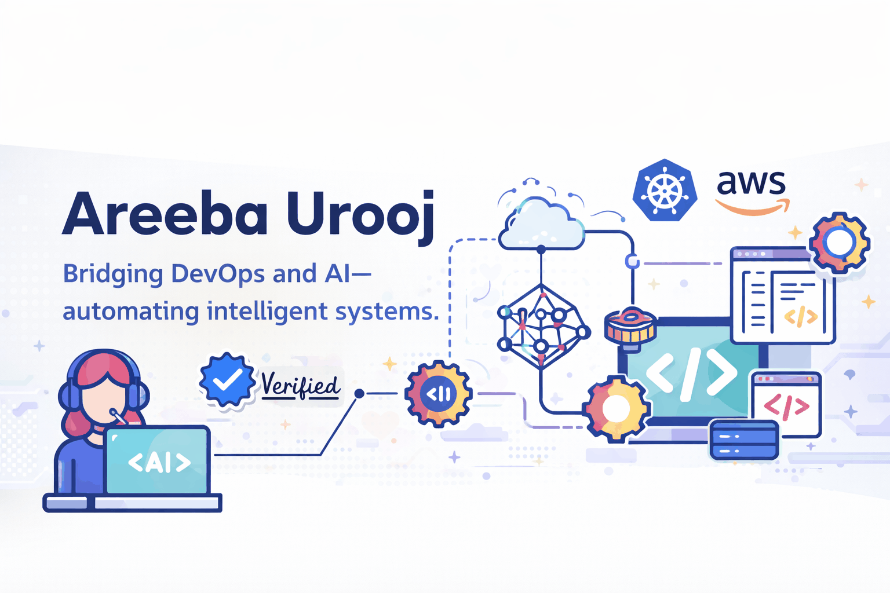

<h2 align="center">Satya Sourav Patel</h2>

<h4 align="center">
AIOps Engineer · DevOps → AI Automation · Cloud & LLM Infrastructure
</h4>

<!-- 

  

 -->

### 👋 About Me

I transitioned from **DevOps engineering** into **AIOps and AI automation**, where I design and operate **cloud-native, production-ready AI systems**. My work sits at the intersection of **infrastructure, automation, and applied AI** — turning manual ops into intelligent workflows.

I specialize in **LLM-powered pipelines**, **event-driven automation**, and **cost-aware AI deployments**, with a strong focus on reliability, observability, and scalability in real-world environments.

---

### 🚀 What I Work On

- AIOps pipelines & AI-driven automation  
- Production **LLM systems** (model selection, cost & latency tradeoffs)  
- Workflow automation using **n8n**, APIs, and webhooks  
- Cloud infrastructure on **AWS & GCP**  
- **CI/CD for AI workloads** (GitHub Actions, GitLab)  
- Containerized services with **Docker & Kubernetes**  
- Infrastructure as Code using **Terraform**  
- Monitoring & observability for AI-enabled systems  

---

### 🧰 Tech Stack

🤖 AIOps · AI Automation · LLMs

 <!-- n8n -->  <!-- WordPress -->  <!-- OpenAI --> <!-- Ollama -->  

☁️ Cloud · DevOps · Infrastructure

  

⚙️ Automation · CI/CD · Tooling

  

🔍 Observability · Reliability

  

---

### 📊 GitHub Stats (Live)

> These stats are generated directly from GitHub and reflect my real activity.

  

  

  

---

### 🤝 Open To

- AIOps & AI Infrastructure projects  
- LLM automation & production AI systems  
- Cloud automation & DevOps consulting  
- Technical writing & knowledge sharing  

📫 **Email: satyasouravssp0@gmail.com**

