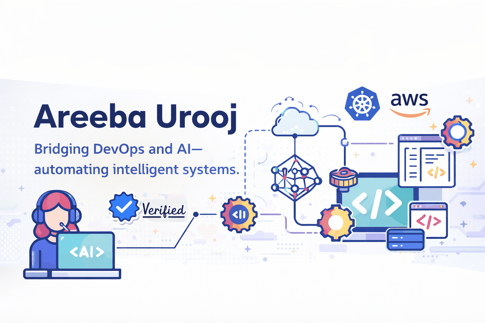

<h2 align="center">Satya Sourav Patel</h2>

<h4 align="center">
Software Engineer · DevOps Engineer · Cloud-Native Systems · Automation
</h4>

<!-- 

  

 -->

### 👋 About Me

I am a **Software Engineer and DevOps Engineer** focused on building, deploying, and operating reliable **cloud-native applications and distributed systems**.

My work spans both **backend software engineering and platform engineering** — developing APIs and services using **Java, Spring Boot, Python, and relational databases**, while also designing the infrastructure, CI/CD pipelines, Kubernetes environments, and observability systems required to run them reliably in production.

I enjoy working across the complete software lifecycle: **designing APIs, writing backend services, containerizing applications, automating deployments, provisioning cloud infrastructure, monitoring production systems, and troubleshooting distributed applications**.

My current focus is becoming a stronger end-to-end engineer capable of taking a product from **code → infrastructure → deployment → production**.

---

### 🚀 What I Work On

* Backend development using **Java 17, Spring Boot & REST APIs**
* Microservices and cloud-native application architecture
* **Spring Data JPA, Hibernate, PostgreSQL & MySQL**
* Unit and integration testing using **JUnit & Mockito**
* Application builds and dependency management using **Maven**
* Cloud infrastructure on **AWS & Azure**
* **Docker & Kubernetes** based application platforms
* CI/CD pipelines using **GitHub Actions, GitLab CI/CD & Jenkins**
* GitOps deployments using **Argo CD**
* Infrastructure as Code using **Terraform & Ansible**
* Monitoring and observability using **Prometheus, Grafana & CloudWatch**
* DevSecOps, automation, and production reliability
* Python and Bash automation for cloud and operational workflows

---

### 🧰 Tech Stack

#### 💻 Software Engineering · Backend

  

**Java 11/17 · Spring Boot · Spring Web/MVC · Spring Data JPA · Hibernate · REST APIs · JUnit · Mockito · Maven**

---

#### ☁️ Cloud · DevOps · Infrastructure

  

**AWS · Azure · Kubernetes · Docker · Terraform · Ansible · Helm · Linux · Networking**

---

#### ⚙️ CI/CD · GitOps · Automation

  

**GitHub Actions · GitLab CI/CD · Jenkins · Azure DevOps · Argo CD · Git · Bash · Python Automation**

---

#### 🔍 Observability · Reliability

  

**Prometheus · Grafana · AWS CloudWatch · Datadog · Azure Monitor · OpenTelemetry**

---

#### 🔐 DevSecOps · Security

**SonarQube · Trivy · OWASP ZAP · AWS IAM · Kubernetes RBAC · Network Policies · Secrets Management**

---

### 🏗️ Areas I'm Exploring

* Distributed systems & system design
* Production-grade Java microservices
* Event-driven architectures
* High-scale backend systems
* AWS application architecture
* Platform engineering
* Kubernetes internals
* Observability & distributed tracing
* AI-assisted software and DevOps engineering

---

### 🎯 Current Focus

Building projects that combine **software engineering + cloud + DevOps** to understand how real-world systems are designed and operated end-to-end.

> **Build the application. Build the platform. Automate the delivery. Operate it reliably.**

---

<!--### 📊 GitHub Stats (Live)

> These stats are generated directly from GitHub and reflect my real activity.

  

  

  

---
-->
### 🤝 Open To

- AIOps & AI Infrastructure projects  
- LLM automation & production AI systems  
- Cloud automation & DevOps consulting  
- Technical writing & knowledge sharing  

📫 **Email: satyasouravssp0@gmail.com**

